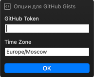

# [PopClip](https://pilotmoon.com/popclip/) extensions

Required install php 8 from homebrew:
```shell
brew install php
```

## Timestamp converter


Unix timestamps to / from human-readable datetime format.

- Y-m-d H:i:s → seconds
- Y-m-d → seconds
- seconds → Y-m-d H:i:s

## GitHub Gists creator


Create a private gist from selected text and get a raw-link to it.\
